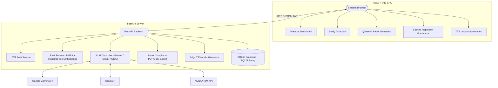
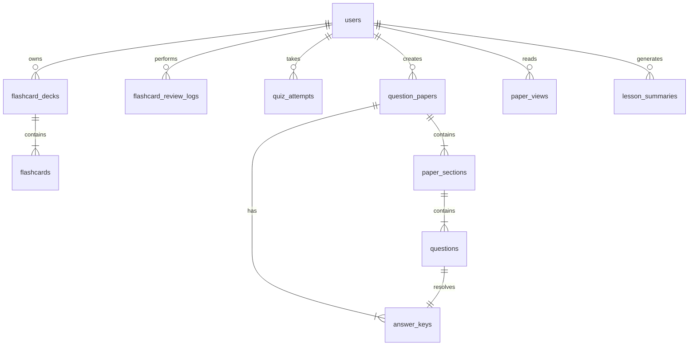

# 🎓 Capable Studio: Full-Stack AI-Powered Smart Study Suite

Capable Studio is a premium, full-stack smart study suite designed to empower students with state-of-the-art educational tools. It integrates multi-format document retrieval-augmented generation (RAG), dynamic question paper compilers, spaced repetition flashcard study engines based on the SuperMemo-2 algorithm, automatic text-to-speech audio lessons, multi-modal diagram vision analyzers, and educational content scrapers into a unified platform.

The system is built with a **FastAPI** backend (featuring [LangChain](https://python.langchain.com/) and [FAISS](https://github.com/facebookresearch/faiss)) and a modern **React + Vite + TypeScript** frontend styled with **Tailwind CSS v4**.

---

## 🗺️ System Architecture

The following diagram illustrates the flow of data between the student’s browser, the FastAPI backend, and external LLM/OCR/TTS providers:



---

## 🗄️ Database Schema & Relationships

The application uses an SQLite database (`app.db`) managed via SQLAlchemy ORM. The schema models student progression, generated papers, study logs, summaries, and spaced-repetition schedules:



---

## 🚀 Key Features & Technical Implementations

### 1. Per-User Isolated Retrieval-Augmented Generation (RAG)
* **Backend Entrypoint:** [rag.py Router](file:///d:/Agents/Capable-Project/backend/app/routers/rag.py)
* **Core Logic:** [RAGService](file:///d:/Agents/Capable-Project/backend/app/services/rag.py) & [RAG Lifecycle Manager](file:///d:/Agents/Capable-Project/backend/app/services/rag_state.py)
* **Frontend Component:** [RAGWorkspacePage.tsx](file:///d:/Agents/Capable-Project/frontend/src/pages/RAGWorkspacePage.tsx)
* **Implementation Details:**
  - **Data Loader:** Supports parsing and loading multiple formats:
    - PDFs loaded via `pdfplumber` in [extractor.py](file:///d:/Agents/Capable-Project/backend/app/services/extractor.py#L7-L16).
    - Microsoft Word DOCX files loaded via `python-docx` in [extractor.py](file:///d:/Agents/Capable-Project/backend/app/services/extractor.py#L19-L29).
    - Web pages parsed using Beautiful Soup 4 in `RAGService.load_from_url`.
  - **Chunking Strategy:** Text chunks are split dynamically using LangChain's `RecursiveCharacterTextSplitter` with a chunk size of `1000` characters and a chunk overlap of `200` characters.
  - **Embeddings & Storage:** Uses local Sentence Transformers (`sentence-transformers/all-MiniLM-L6-v2`) via HuggingFace Embeddings. Each student gets their own sandbox vector store index built using **FAISS (CPU)**, isolated in the folder `backend/media/rag_stores/user_{user_id}` and persisted dynamically on document uploads.
  - **Fallback Chain:** Orchestrated in [ai.py](file:///d:/Agents/Capable-Project/backend/app/ai.py), queries fall back gracefully from Google Gemini to Groq (Llama-3) and NVIDIA NIM APIs depending on active keys in configuration.

### 2. Spaced Repetition Flashcard System (SuperMemo-2)
* **Backend Entrypoint:** [flashcards.py Router](file:///d:/Agents/Capable-Project/backend/app/routers/flashcards.py)
* **Core Logic:** [FlashcardService](file:///d:/Agents/Capable-Project/backend/app/services/flashcards.py)
* **Frontend Component:** [FlashcardStudyPage.tsx](file:///d:/Agents/Capable-Project/frontend/src/pages/FlashcardStudyPage.tsx)
* **Implementation Details:**
  - **Flashcard Generation:** Extracts major concepts from indexed study materials. The prompt instructs the LLM to yield structural JSON with `question` and `answer` properties, bulk-inserting them into the [flashcards](file:///d:/Agents/Capable-Project/backend/app/models.py#L70-L83) table.
  - **SM-2 Scheduling Algorithm:** Implements the classic SuperMemo-2 logic during card review in [flashcards.py Router:L132-164](file:///d:/Agents/Capable-Project/backend/app/routers/flashcards.py#L132-L164):
    - Re-evaluates Easy Factor ($EF$) based on student response score ($q \in [0, 5]$):
      $$EF_{new} = EF_{old} + (0.1 - (5 - q) \times (0.08 + (5 - q) \times 0.02))$$
    - If the score $q \ge 3$, the card is scheduled for a future review with interval:
      - First repetition: 1 day
      - Second repetition: 6 days
      - Subsequent repetitions: $Interval_{new} = round(Interval_{old} \times EF)$
    - If the score $q < 3$, the repetition sequence resets (interval set to 1 day, repetitions set to 0).
    - Minimizes boundary issues by capping $EF \ge 1.3$.

### 3. Dynamic Question Paper Generator & Regenerator
* **Backend Entrypoint:** [papers.py Router](file:///d:/Agents/Capable-Project/backend/app/routers/papers.py)
* **Core Logic:** [PaperService](file:///d:/Agents/Capable-Project/backend/app/services/papers.py)
* **Frontend Component:** [PaperGeneratePage.tsx](file:///d:/Agents/Capable-Project/frontend/src/pages/PaperGeneratePage.tsx)
* **Implementation Details:**
  - **Multi-Section Compilation:** Generates specialized test questions from student documents for:
    - Multiple Choice Questions (MCQ) - parsed into 4 choices.
    - True/False Statement questions.
    - Fill-in-the-blank questions (substituting a key term with `____`).
    - Short Answer questions (1-3 sentences with auto-suggested evaluation keywords).
    - Long Answer questions (synthesizing content across multiple paragraphs with rubric marking schemes).
    - Case Study passages (multi-paragraph scenario passage followed by 3-5 sub-questions).
  - **Distribution of Difficulty:** Adapts to requested difficulty levels ("easy", "medium", "hard", "mixed"). A "mixed" request splits the paper's section difficulty dynamically (30% Easy, 50% Medium, 20% Hard) using `PaperService._distribute_difficulty`.
  - **Granular Question Regeneration:** Allows students to target individual questions for replacement in [papers.py Router:L187-251](file:///d:/Agents/Capable-Project/backend/app/routers/papers.py#L187-L251) without modifying other sections.
  - **Multi-Format Document Export:** Generates custom PDFs with a clean header, line-separated sections, and distinct answer keys via `ReportLab` in [pdf_export.py](file:///d:/Agents/Capable-Project/backend/app/services/pdf_export.py), or creates formatted Microsoft Word files via `python-docx` on demand.

### 4. Student Analytics Dashboard & Performance Tracking
* **Backend Entrypoint:** [analytics.py Router](file:///d:/Agents/Capable-Project/backend/app/routers/analytics.py)
* **Frontend Component:** [AnalyticsDashboardPage.tsx](file:///d:/Agents/Capable-Project/frontend/src/pages/AnalyticsDashboardPage.tsx)
* **Implementation Details:**
  - **Centralized Metrics:** Computes cumulative and rolling metrics:
    - Flashcard status (active decks, total cards, due cards, reviews over the past 7 days).
    - Quiz performance metrics (total attempts, moving average score, personal best).
    - Question papers compiled and views logged.
  - **Dynamic Progression Trends:** Collects recent quiz scores in chronological order, generating a dynamic score trend matrix (`ScoreTrendPoint`) rendered using modern charting libraries in the user interface.

### 5. Adaptive Quiz Engine
* **Backend Entrypoint:** [quiz.py Router](file:///d:/Agents/Capable-Project/backend/app/routers/quiz.py)
* **Core Logic:** [adaptive_difficulty.py](file:///d:/Agents/Capable-Project/backend/app/services/adaptive_difficulty.py)
* **Frontend Component:** [QuizPage.tsx](file:///d:/Agents/Capable-Project/frontend/src/pages/QuizPage.tsx)
* **Implementation Details:**
  - **Performance-Driven Difficulty:** Uses a moving window lookback of the student's last 5 quiz attempts:
    - **Score Average $\ge$ 80%:** Promotes difficulty to **Hard** to challenge comprehension.
    - **Score Average $\ge$ 55%:** Maintains difficulty at **Medium** to consolidate core knowledge.
    - **Score Average $<$ 55%:** Adjusts difficulty to **Easy** to build fundamentals.
  - **Explanations:** Explains the pedagogical rationale to the student on the dashboard (e.g. *"Strong recent performance (85% average) — try harder questions. Suggested change from your last quiz (medium)"*).

### 6. Text-to-Speech Audio Lessons
* **Backend Entrypoint:** [lessons.py Router](file:///d:/Agents/Capable-Project/backend/app/routers/lessons.py)
* **Core Logic:** [lesson_summary.py](file:///d:/Agents/Capable-Project/backend/app/services/lesson_summary.py)
* **Frontend Component:** [LessonsPage.tsx](file:///d:/Agents/Capable-Project/frontend/src/pages/LessonsPage.tsx)
* **Implementation Details:**
  - **Lesson Synthesis:** Generates a concise spoken study summary (200-350 words) covering key definitions, topics, and actionable study takeaways.
  - **Audio Rendering:** Uses `edge-tts` to synthesize high-quality en-US neural voice (`en-US-AriaNeural`) MP3 files, stored under `backend/media/lessons/` and served statically via FastAPI.

### 7. External Source Harvesters (YouTube, Khan Academy, Quizlet)
* **Backend Entrypoint:** [educational_sources.py Router](file:///d:/Agents/Capable-Project/backend/app/routers/educational_sources.py)
* **Core Logic:** [khan_source.py](file:///d:/Agents/Capable-Project/backend/app/services/khan_source.py) & [youtube_source.py](file:///d:/Agents/Capable-Project/backend/app/services/youtube_source.py)
* **Frontend Component:** [SourcesPage.tsx](file:///d:/Agents/Capable-Project/frontend/src/pages/SourcesPage.tsx)
* **Implementation Details:**
  - **YouTube Transcripts:** Parses video ID patterns (including standard URLs, short links, and embed nodes). Extracts transcripts using the `youtube-transcript-api` and indexes them directly into the student's vector database.
  - **Khan Academy Topic Crawling:** Uses HTTP search requests and regex extraction to crawl topics on Khan Academy search pages, and crawls topic hierarchies using their public API.
  - **Quizlet Vocabulary Imports:** Implements standard schema importers to ingest front-and-back flashcard lists in JSON and map them directly to study decks.

### 8. Multimodal Diagram & Image Vision Analyzer
* **Backend Entrypoint:** [diagram.py Router](file:///d:/Agents/Capable-Project/backend/app/routers/diagram.py)
* **Core Logic:** [diagram_analysis.py](file:///d:/Agents/Capable-Project/backend/app/services/diagram_analysis.py)
* **Implementation Details:**
  - **Vision Processing:** Resizes large images (capping at 1280x1280 pixels) to optimize bandwidth. Encodes the payload in base64.
  - **Dual Pipeline:** Sends images to Gemini Vision or Nvidia NIM models (Mistral Large) to parse overview, key parts, and lessons. If an LLM key is absent, the system falls back to Google Cloud Vision API to extract OCR text and detect labels.

### 9. Token-Based Authentication & Account Recovery
* **Backend Entrypoint:** [auth/router.py](file:///d:/Agents/Capable-Project/backend/app/auth/router.py)
* **Core Logic:** [auth/utils.py](file:///d:/Agents/Capable-Project/backend/app/auth/utils.py)
* **Frontend Component:** [LoginPage.tsx](file:///d:/Agents/Capable-Project/frontend/src/pages/LoginPage.tsx), [SignupPage.tsx](file:///d:/Agents/Capable-Project/frontend/src/pages/SignupPage.tsx), [ForgotPasswordPage.tsx](file:///d:/Agents/Capable-Project/frontend/src/pages/ForgotPasswordPage.tsx)
* **Implementation Details:**
  - **Password Security:** Hashes passwords with `bcrypt`.
  - **JWT Tokens:** Generates signature-verified access tokens using standard JWT payloads.
  - **Recovery Tokens:** Uses secure token generators with database-backed expiry timestamps to handle password resets safely.

---

## 📂 Project Directory Structure

```
Capable-Project/
├── backend/                       # Python FastAPI Backend
│   ├── app/                       # Application source code
│   │   ├── auth/                  # Authentication Module
│   │   │   ├── dependencies.py    # Depends: JWT and current user retrieval
│   │   │   ├── models.py          # User DB schema
│   │   │   ├── ownership.py       # Entity authorization check helpers
│   │   │   ├── router.py          # Signup, Login, Password Reset endpoints
│   │   │   ├── schemas.py         # Pydantic schemas for auth requests
│   │   │   └── utils.py           # Passwords and JWT helpers
│   │   ├── routers/               # HTTP Routers
│   │   │   ├── analytics.py       # Metrics compiling & trends endpoints
│   │   │   ├── diagram.py         # Image vision analysis endpoints
│   │   │   ├── educational_sources.py  # YT transcripts, Khan cralwer, Quizlet import
│   │   │   ├── flashcards.py      # Flashcard management and SM-2 review
│   │   │   ├── lessons.py         # TTS summary synthesis endpoints
│   │   │   ├── papers.py          # Question papers generation and export
│   │   │   ├── query.py           # Simple log query endpoints
│   │   │   ├── quiz.py            # Quiz generating and scoring endpoints
│   │   │   └── rag.py             # Document vector search / query routing
│   │   ├── services/              # Business Logic Services
│   │   │   ├── adaptive_difficulty.py  # Lookback-based quiz difficulty recommender
│   │   │   ├── diagram_analysis.py # Vision parser / Google Vision OCR fallback
│   │   │   ├── extractor.py       # pdfplumber / python-docx content extraction
│   │   │   ├── flashcards.py      # Flashcards AI generator
│   │   │   ├── khan_source.py     # Khan Academy public scaper
│   │   │   ├── lesson_summary.py  # edge-tts lesson compiler
│   │   │   ├── llm.py             # Simple AI query pipeline
│   │   │   ├── papers.py          # Multi-section compiler logic
│   │   │   ├── pdf_export.py      # ReportLab question paper exporter
│   │   │   ├── quiz_generator.py  # Structured LLM MCQs generator
│   │   │   ├── quizlet_import.py  # Quizlet vocabulary parser
│   │   │   ├── rag.py             # FAISS indexing, similarity, querying
│   │   │   ├── rag_state.py       # Isolated user vector store instances
│   │   │   └── youtube_source.py  # YouTube transcript extraction
│   │   ├── ai.py                  # LLM setup and fallbacks initialization
│   │   ├── config.py              # Configuration manager & Environment loader
│   │   ├── database.py            # SQLite database initializer and migrations
│   │   ├── main.py                # FastAPI main application entrypoint
│   │   ├── models.py              # Core SQLAlchemy database models
│   │   └── schemas.py             # Shared Pydantic request/response schemas
│   ├── pyproject.toml             # Python uv dependencies file
│   ├── Dockerfile                 # Backend container configuration
│   └── docker-compose.yml         # Devops orchestration configuration
│
└── frontend/                      # React Frontend
    ├── src/                       # Frontend source code
    │   ├── assets/                # Static assets (images, logos)
    │   ├── components/            # Shared components
    │   │   ├── ui/                # Core buttons, input, alerts components
    │   │   ├── DashboardLayout.tsx # Persistent sidebar layout
    │   │   ├── FormattedMarkdown.tsx # Markdown renderer for answers
    │   │   ├── ProtectedRoute.tsx # Route guard for active JWT
    │   │   └── VoiceInputButton.tsx # Microphone speech-to-text bridge
    │   ├── hooks/                 # Custom React hooks
    │   ├── lib/                   # API client and authentication helpers
    │   │   ├── api-client.ts      # Fetch API wrapper with auth injection
    │   │   ├── auth.ts            # Token storage and validation
    │   │   └── utils.ts           # Class merge helpers (cn)
    │   ├── pages/                 # Route Pages
    │   │   ├── AnalyticsDashboardPage.tsx # Student dashboard charts
    │   │   ├── FlashcardDashboard.tsx # Active flashcard decks list
    │   │   ├── FlashcardGeneratePage.tsx # Upload/generator page
    │   │   ├── FlashcardStudyPage.tsx # SM-2 card study interface
    │   │   ├── ForgotPasswordPage.tsx # Request token page
    │   │   ├── LessonsPage.tsx    # Audio summary synthesis list
    │   │   ├── LoginPage.tsx      # Sign-in page
    │   │   ├── PaperDashboard.tsx # Question papers dashboard
    │   │   ├── PaperGeneratePage.tsx # Exam compiler settings
    │   │   ├── PaperPreviewPage.tsx # Question list and export controls
    │   │   ├── QuizPage.tsx       # Interactive multiple-choice testing
    │   │   ├── RAGWorkspacePage.tsx # AI study assistant workspace
    │   │   ├── ResetPasswordPage.tsx # Recover credentials page
    │   │   ├── SignupPage.tsx     # Student registration page
    │   │   └── SourcesPage.tsx    # YouTube transcripts & Khan crawler
    │   ├── providers/             # Global providers (theme, settings)
    │   ├── services/              # API Client communication services
    │   ├── App.tsx                # App routes setup
    │   ├── index.css              # Global styles & Tailwind v4 theme configurations
    │   └── main.tsx               # Frontend bootstrap React index
    ├── package.json               # Frontend dependencies configuration
    ├── index.html                 # Main single page application index
    └── vite.config.ts             # Vite server and configuration settings
```

---

## ⚙️ Configuration & Environment Settings

Create a `.env` file inside the `backend` folder (based on [backend/.env.example](file:///d:/Agents/Capable-Project/backend/.env.example)):

```bash
# Host database URL
DATABASE_URL=sqlite:///./app.db

# Dev / Production Toggle
ENVIRONMENT=development

# JWT Secret key (use a strong random value in production)
SECRET_KEY=capable-project-dev-only-not-for-production
JWT_ALGORITHM=HS256
TOKEN_EXPIRE_MINUTES=60

# Primary LLM provider: "gemini", "groq", or "nvidia"
LLM_PRIMARY_PROVIDER=gemini

# Google AI credentials (required for Gemini LLM / Gemini Embeddings / OCR)
GOOGLE_API_KEY=your_gemini_api_key

# Groq API credentials (optional fallback)
GROQ_API_KEY=your_groq_api_key

# NVIDIA API credentials (optional fallback)
NVIDIA_API_KEY=your_nvidia_api_key

# Model selections
GEMINI_MODEL=gemini-2.5-flash
GROQ_MODEL=llama-3.3-70b-versatile
NVIDIA_MODEL=meta/llama-3.3-70b-instruct
NVIDIA_VISION_MODEL=mistralai/mistral-large-3-675b-instruct-2512

# Sentence Transformers Configuration
EMBEDDING_MODEL_NAME=sentence-transformers/all-MiniLM-L6-v2
EMBEDDING_DEVICE=cpu
```

---

## 🛠️ Step-by-Step Setup & Deployment

### 📋 Prerequisites
- Python 3.10+ installed
- [uv Package Manager](https://github.com/astral-sh/uv) installed
- Node.js (version 18+) and npm installed

---

### 1. Backend Service Configuration (FastAPI)

1. Navigate to the backend directory:
   ```bash
   cd backend
   ```
2. Sync the project dependencies (creates a local virtual environment `.venv` and locks packages automatically):
   ```bash
   uv sync
   ```
3. Start the FastAPI development server:
   ```bash
   uv run fastapi dev app/main.py
   # Or directly run Uvicorn:
   # uv run uvicorn app.main:app --reload
   ```
4. Access endpoints:
   - Interactive Swagger API Documentation: [http://localhost:8000/docs](http://localhost:8000/docs)
   - Welcome route: [http://localhost:8000/](http://localhost:8000/)

5. **(Optional) Run Backend Test Suite:**
   Verify RAG vector operations and loading processes using:
   ```bash
   uv run python test_rag.py
   ```

---

### 2. Frontend User Interface Configuration (React)

1. Navigate to the frontend directory:
   ```bash
   cd frontend
   ```
2. Install npm package dependencies:
   ```bash
   npm install
   ```
3. Run the development server:
   ```bash
   npm run dev
   ```
4. Access the web interface at [http://localhost:5173/](http://localhost:5173/) in your web browser.

---

### 3. Container Deployment (Docker & Compose)

To run both services in containers, run the following command in the `backend` folder:
```bash
docker-compose up --build -d
```
This builds and runs:
- The backend app inside the container listening on host port `8000`.
- The SQLite database volume mapped locally inside the container's virtual workspace.
- Hot reloads with dynamic file modifications when the mount pathways are configured.

---

## 📚 References & Libraries Used

### Backend Technologies
- **[FastAPI](https://fastapi.tiangolo.com/)**: Async framework for routing, validations, and response parsing.
- **[LangChain](https://python.langchain.com/)**: AI orchestration framework for chain construction, agent tools, prompts, and structured output parsing.
- **[FAISS (Facebook AI Similarity Search)](https://github.com/facebookresearch/faiss)**: Fast vector search library used for indexing document chunk embeddings.
- **[SQLAlchemy](https://www.sqlalchemy.org/)**: Python SQL toolkit and ORM mapping python models to the SQLite database.
- **[ReportLab](https://www.reportlab.com/)**: Graphics and PDF generation engine used to compile revision sheets.
- **[edge-tts](https://github.com/rany2/edge-tts)**: Microsoft Edge Speech Synthesis interface used to render audio lessons.
- **[pdfplumber](https://github.com/jasonmc/pdfplumber)**: Extracts structured text paragraphs and characters from PDF documents.
- **[python-docx](https://python-docx.readthedocs.io/)**: Library for reading and writing Microsoft Word files.

### Frontend Technologies
- **[React](https://react.dev/)**: Dynamic component building UI engine.
- **[Vite](https://vitejs.dev/)**: Frontend build tool and bundler.
- **[Tailwind CSS v4](https://tailwindcss.com/)**: Utility-first CSS layout engine for page styling.
- **[Lucide Icons](https://lucide.dev/)**: Crisp SVG vector icon pack.
- **[React Router v6](https://reactrouter.com/)**: Configures SPA page paths and protected route boundaries.
